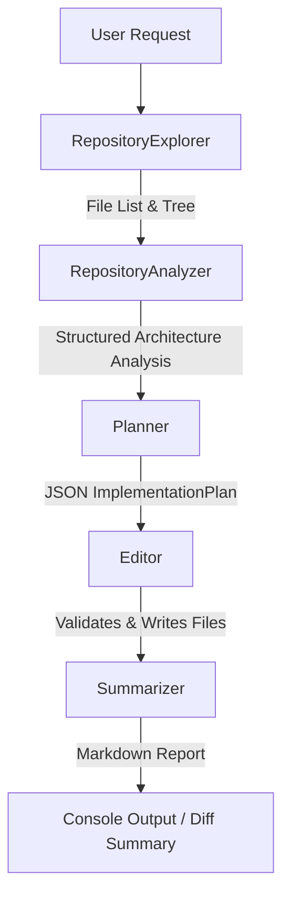

# 🚀 AI Coding Agent

A focused, framework-agnostic Python agent designed to explore an existing target repository, analyze its structure, create a surgical execution plan, and implement product requirements with minimal user guidance.

Target Application: [callicoder/node-easy-notes-app](https://github.com/callicoder/node-easy-notes-app) (Node.js & Express / Mongoose)  
Agent Stack: **Python 3.12**, **Pydantic v2**, **OpenAI API / Groq LLM Provider**

---

## 📹 Screen Recording Deliverable

> [!IMPORTANT]
> **Demo Recording**: [Click here to watch the 2–3 Minute Video Demonstration on Google Drive https://drive.google.com/file/d/1J958ITnA6NySALlI7LTKdfWcooHAXlz0/view?usp=sharing

---

## 🏗️ Architecture & Pipeline Workflow

The agent follows a deterministic, 5-stage pipeline design where each stage performs a single responsibility and passes structured data objects to the next stage.



### Component Breakdown

* **`agent/explorer.py` (`RepositoryExplorer`)**: Performs a non-destructive scan using `pathlib.Path.rglob`. Filters out build outputs, assets, and dependency directories (`node_modules`, `.git`, `dist`, etc.) and renders an indented tree representation of the codebase.
* **`agent/analyzer.py` (`RepositoryAnalyzer`)**: Reads `package.json` to detect dependencies, frameworks (Express, Fastify, Koa), database drivers (Mongoose, PostgreSQL, MySQL), and entry points. Categorizes files into standard roles (`models`, `controllers`, `routes`, `config_files`).
* **`agent/planner.py` (`Planner`)**: Passes the repo structure, dependency summary, and user request to the LLM. Enforces a strict Pydantic JSON schema ([`ImplementationPlan`](file:///c:/Users/Shreyansh%20Kesarwani/Downloads/ai-coding-agent/ai-coding-agent/models/plan.py#L21-L28)) to produce reasoning, feature requirements, targeted files, and step-by-step editing instructions.
* **`agent/editor.py` (`Editor`)**: Receives the target files from the plan. Constructs a focused prompt containing only the current file content, relevant plan steps, and user request. Performs sanity checks ([`EditValidationError`](file:///c:/Users/Shreyansh%20Kesarwani/Downloads/ai-coding-agent/ai-coding-agent/agent/editor.py#L17-L19)) to ensure responses aren't truncated or malformed before writing to disk.
* **`agent/summarizer.py` (`Summarizer`)**: Formats a human-readable Markdown summary detailing modified files, implemented features, technical rationale, and potential risks.
* **`agent/workflow.py` (`AgentWorkflow`)**: Orchestrates the linear workflow execution sequence and manages log outputs.

---

## 🔍 Repository Exploration Strategy

To prevent unnecessary token expenditure and context window clutter, the agent **never dumps the entire codebase into the LLM context window**.

1. **Deterministic File Filtering**: Assets (`.png`, `.jpg`, `.ico`), lockfiles, and environment files are stripped prior to analysis.
2. **Targeted Reading**: `RepositoryAnalyzer` only inspects configuration descriptors (`package.json`) and source file paths.
3. **Context Capping**: The `Editor` limits prompt content per file via `MAX_FILE_CHARS_FOR_PROMPT = 6000`, ensuring fast response latency and zero context degradation.

---

## 💬 Prompt Engineering & Schema Enforcement

All prompt templates are centralized in [`prompts.py`](file:///c:/Users/Shreyansh%20Kesarwani/Downloads/ai-coding-agent/ai-coding-agent/prompts.py):

* **Planner Prompt**: Instructs the LLM to act as a senior software engineer making surgical, minimal edits while preserving all existing functionality. Enforces pure JSON output conforming strictly to Pydantic models.
* **Editor Prompt**: Restricts the LLM to return **raw, executable code only** without markdown code fences, commentary, or extraneous text.

---

## 🛠️ Setup & Installation

### Prerequisites
* **Python 3.12**
* **Git** installed on system path

### 1. Installation
Clone this repository and install the dependencies:

```bash
git clone https://github.com/your-username/ai-coding-agent.git
cd ai-coding-agent
python -m venv venv
source venv/bin/activate  # On Windows: venv\Scripts\activate
pip install -r requirements.txt
```

### 2. Environment Configuration
Create a `.env` file in the root directory:

```env
# OpenAI or Groq API Configuration
OPENAI_API_KEY=gsk_your_api_key_here
OPENAI_MODEL=llama-3.3-70b-versatile
```

---

## 🚀 Running the Agent

### Non-Interactive / Scripting Mode (Recommended)

Run the agent against a local directory or remote GitHub URL:

```bash
python main.py \
  --repo node-easy-notes-app \
  --request "Improve the application so users can better organise and search their notes."
```

### Interactive CLI Mode

Launch the interactive CLI prompt:

```bash
python main.py
```

1. Enter target GitHub repository URL or local folder path when prompted.
2. Enter the feature request.
3. Observe live execution logs as the pipeline progresses.

---

## 📄 Example Execution Output

```markdown
Scanning repository...
Analyzing project...
Creating implementation plan...
Editing files...
Generating summary...
Done.

# Change Summary

## Modified Files
- `app/models/note.model.js`
- `app/controllers/note.controller.js`

## Features Added
- Tag array and category fields in Note schema
- Query parameter filtering by `category`, `tags`, and regex keyword search in `findAll`

## Reasoning
The existing Note model and controller handle standard CRUD operations. Adding optional `category` and `tags` fields along with regex search parameters on `GET /notes` fulfills organization and search requirements without introducing new database schemas or third-party search indexes.

## Potential Risks
- Changes were generated by an LLM and should be reviewed before merging.
- No automated unit tests were executed against modified routes.
```

---

## ⚖️ Assumptions & Trade-Offs

| Decision | Trade-off / Rationale |
| :--- | :--- |
| **Deterministic Analyzer Heuristics** | Fast, cheap, and reliable for standard Node/Express structures without burning tokens. Non-standard folder structures fall back to basic role matching. |
| **Full File Replacement vs. Unified Diffs** | Full file rewrites avoid diff-patch application failures commonly produced by LLMs, ensuring 100% syntactically valid files at the cost of higher output token counts for large files. |
| **Fail-Fast Error Handling** | Validation checks throw explicit errors (`EditValidationError`, `LLMError`) rather than executing hidden retry loops, keeping behavior predictable and easy to debug. |

---

## 📊 Evaluation Criteria Alignment

| Criteria | Coverage & Proof |
| :--- | :--- |
| **Correctness** | Implements category, tag filtering, and search query capability while strictly preserving existing Express CRUD routes. |
| **Architecture** | Clean 5-stage pipeline pattern with separated Explorer, Analyzer, Planner, Editor, and Summarizer modules. |
| **Repo Exploration** | Intelligent directory tree generation and rule-based role bucketing without dumping unindexed files to LLM prompts. |
| **Code Quality** | Fully typed Python 3.11+, Pydantic schema validation, robust exception handling, and clean CLI reporting. |
| **Documentation** | Thorough README covering workflow, prompt design, setup, trade-offs, and screen recording link. |

---

## 📜 License

Distributed under the MIT License. See `LICENSE` for more information.
